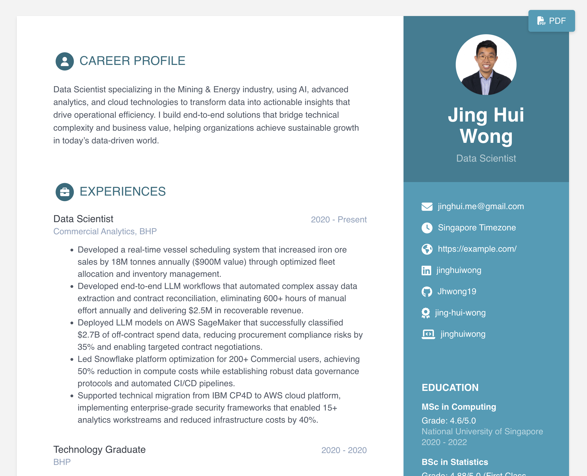

# Resume building

> This repository allows you to create a professional resume GitHub page using Jekyll. It generates a static HTML page from the `_data/data.yml` file, making it easy to maintain and update your resume in one place.

Simply fork this repository, update the `_data/data.yml` file with your personal information, and GitHub Pages will automatically build your resume site.

Feel free to fork this repository, share it with others, and give it a star if you find it helpful!

## Preview

Below is a preview of how your resume will look after customization:

The theme features a clean, content-focused design with a sidebar for your personal information and main sections for your professional experience, skills, and education.

## Credits

Thanks to [Nelson Estevão](https://github.com/nelsonmestevao) for all the [contributions](https://github.com/sharu725/online-cv/commits?author=nelsonmestevao).

Thanks to [t-h-e(sfrost)](https://github.com/t-h-e) for all the [contributions](https://github.com/sharu725/online-cv/commits?author=t-h-e).

Thanks to [sharu725](https://github.com/sharu725) for all the [contributions](https://github.com/sharu725/online-cv).

Check out for more themes: [**Jekyll Themes**](http://jekyll-themes.com).

